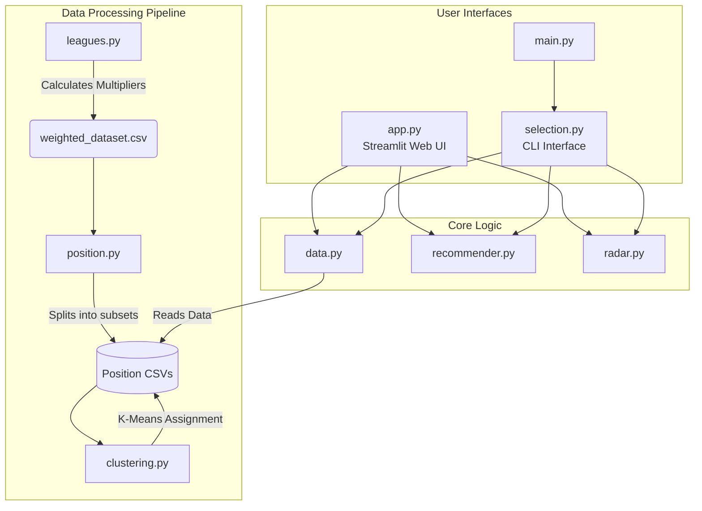

# Player Recommender Engine

## Overview
The Statistical Football Scout is an intelligent scouting system built to recommend football players based on statistical similarities and tactical roles. It allows users to find suitable candidates to fill specific positions in a team while adhering to financial constraints. 

## Features
* **Custom Search Filters:** Filter the database by League, Team, and Position (e.g., Goalkeeper, Centerback, Winger, Forward).
* **Financial Adjustments:** Apply strict salary limits and set maximum transfer budget margins based on the team's average market value.
* **Dual Search Strategies:**
  * * *Exact Substitute:* Find players statistically similar to a specific target player.
  * *Ideal Tactic Role:* Search for players that fit a predefined tactical archetype or role.
* **Advanced Recommendation Engine:** Calculates player similarity using Cosine Similarity combined with a normalized quality index. 
* **Penalty for Mistakes:** The engine negatively weights adverse statistics such as "Error Lead To Goal" and "Big Chances Missed" to ensure high-quality recommendations.
* **Visual Analysis:** Includes interactive radar charts to visually compare the recommended candidate's statistics against the target player or ideal role.

## How It Works

### 1. Data Preprocessing & Setup (Offline Phase)
Before the recommendation engine can accept user queries, the data goes through an automated preparation pipeline:
* **League Weighting (`leagues.py`):** Evaluates players based on the difficulty of the league they play in. Top 5 leagues receive a 2.0 multiplier on important stats, the next 14 leagues get a 1.5 multiplier, and lower-level leagues get a 0.8 multiplier. This creates a normalized `weighted_dataset.csv`.
* **Positional Split (`position.py`):** The weighted dataset is separated into distinct CSV files for each fundamental position on the pitch.
* **Tactical Role Clustering (`clustering.py`):** Runs a K-Means clustering algorithm (configured for 4 clusters) on each positional dataset to automatically group players into distinct "Tactical Roles" based on their statistical profiles. 

### 2. Search & Filtering (User Input Phase)
* **Target Selection:** The user defines the context by choosing a League, Team, and Position. 
* **Strategy Choice:** The search can target an "Exact substitute for a player" or an "Ideal tactic role" (searching for the archetype of a specific role found during the clustering phase).
* **Financial & Logical Constraints (`data.py`):** Filters out players who already play for the user's chosen team. It also dynamically applies financial boundaries, filtering candidates based on whether they fit within specific wage and market value margins derived from the target team's current squad.

### 3. Core Engine & Evaluation
Once the candidate pool is established, the data is passed to the engine (`recommender.py`).
* **Scaling and Penalization:** Features are normalized using `StandardScaler`. Negative statistics like "Error Lead To Goal" and "Big Chances Missed" are multiplied by -1 to penalize the candidate.
* **Final Score:** Calculates a Cosine Similarity score between the target vector and candidates, alongside a normalized "Quality Index". The final recommendation score is a weighted blend: 70% relies on profile similarity, and 30% relies on overall objective quality.

### 4. Visualization
The top 10 recommended candidates are presented to the user. Using the `radar.py` module, the user can select any candidate to generate an interactive Plotly scatterpolar chart. This chart plots the raw stats of the selected candidate over the original target profile, allowing scouts to visually assess strengths and weaknesses.

## Module Architecture Diagram

The system relies on a functional programming approach using independent python modules. Below is a Module Dependency Diagram illustrating how the files interact with one another:


## Tech Stack
* **Web Framework:** Streamlit
* **Data Manipulation:** Pandas, NumPy
* **Machine Learning & Math:** Scikit-learn (StandardScaler, KMeans, cosine_similarity)
* **Data Visualization:** Plotly

## Installation

1. Clone the repository to your local machine.
2. Ensure you have Python installed (3.7+ recommended).
3. Install the required dependencies by running the following command in your terminal:
   ```bash
   pip install -r requirements.txt
   ```

## Usage
Running the Web Application:

1. Start the Streamlit application by running:

```bash
streamlit run app.py
```
2. Open your web browser and navigate to the local URL provided in the terminal.

3. Use the sidebar to set your scouting filters (League, Team, Position) and adjust your financial margins.

4. Select your searching strategy (substitute an exact player or search by tactical role).

5. Click "Search substitutes" to generate the top 10 player recommendations.

6. Use the Interactive Radar section to visually compare the recommended candidate against the target profile.

## Running the CLI Application:

1. Start the command-line interface by running:

``` bash
  python main.py
```
2. Follow the terminal prompts to select leagues, teams, and candidates.

## Project Structure
* `app.py`: The main Streamlit application script containing the user interface and frontend logic.

* `main.py` & selection.py: The command-line alternative for interacting with the recommendation engine.

* `recommender.py`: Contains the core mathematical logic and machine learning functions for calculating player similarities.

* `data.py`: Helper module for loading position-specific datasets, defining financial constraints, and vectorizing data.

* `radar.py`: Generates the interactive Plotly radar charts for candidate comparison.

* `leagues.py`, position.py, clustering.py: Scripts used in the offline data preparation pipeline.

* `datasets/`: Directory containing the cleaned, weighted, and positional CSV data files required for the system to run.
